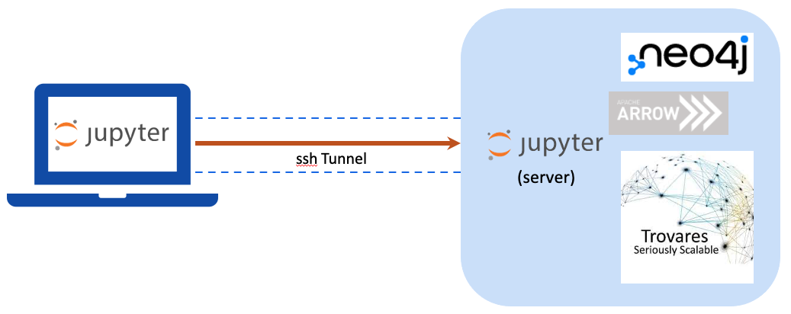

# Instructions for running the Trovares xGT neo4j accelerator

The collection of scripts and jupyter notebooks in this directory contains all that is needed to explore using [Trovares xGT](http://www.trovares.com) as an accelerator for [neo4j](http://www.neo4j.com) queries.

The easiest way to run this demo is to clone this repo into the Linux or virtual Linux environment that will run these notebooks.

The notebooks will download, configure, and run a neo4j Docker container and a Trovares xGT Docker container.

Quick Links:

  - [Platform Requirements](#platform-requirements)
  - [Launching the Jupyter Notebooks](#launching-the-jupyter-notebook-server)
  - [Running the demo](#running-the-demo)

## Platform Requirements

The platform to run this demo must provide these minimal features:

  - Compute cores must be x86; the demo will not run on M1-chip Macbook systems or on ARM-based cloud instances.
  - Python 3.6 or later installed to run the jupyter notebook server.
  - Support for running Docker containers.

Each platform category has specific requirements.

### Windows

WSL2 must be enabled, some distribution of Linux must be installed as a WSL2 subsystem, and [docker desktop](http://www.docker.com) must be installed.

### Mac OS

[Docker desktop](http://www.docker.com) must be installed.

### Linux

A Docker daemon must be installed and configured for running in [rootless mode](https://docs.docker.com/engine/security/rootless/).

## Launching the Jupyter Notebook Server

You can run the jupyter notebook server on your local machine.
In this case, the demo will run locally, including downloading and running the neo4j and xGT Docker containers.
Alternatively, the jupyter notebook server can be run on a remote system, in which case the demo will run there.
In either case, the files in this repo should exist on the system on which the jupyter notebook server will run.

### Windows

To run locally on Windows, the jupyter notebook server must be run on the Linux platform installed inside WSL2.
If there are multiple Linux distributions installed on your Windows systems, use the Linux distribution that the Docker Desktop uses to run its containers.

Open a shell prompt on the Linux platform installed inside WSL2 and clone this repo.
Navigate to the directory holding these notebooks and launch:

```
$ jupyter-notebook --no-browser
```

There will be some output shown in the shell window, something like:

```
  .
  .
Or copy and paste one of these URLs:
    http://localhost:8888/?token=629af6a880bf631170846cda41c3fd475e3e77ff2d19211e
  .
  .
```

You need to copy the url (in this case, `http://localhost:8888/?token=629af6a880bf631170846cda41c3fd475e3e77ff2d19211e`) and paste it into a browser in your Windows environment.

This will open the jupyter session on the browser and show the notebooks for this demo.

### Local Mac OS or Linux

After cloning this repo, simply navigate your Terminal shell to the directory holding these notebooks and launch:

```
$ jupyter-notebook
```

This will open a browser with the jupyter notebooks for this demo.

### Remote (cloud)

If you want to run the server on some remote system such as a cloud instance, you will need to launch the jupyter notebook server on the remote instance.
You will then connect to the jupyter notebook server through a browser on your local system such as a laptop.

The easiest way to accomplish this is to run an [ssh](https://www.openssh.com) tunnel between the client (browser) and remote server platform.



To do this, you must have a shell or Terminal window on your local system from which you can perform an `ssh` connection.
On Windows, this can be a Terminal window, a powershell window, or a Linux shell window if you have Linux installed within WSL2.
On Windows, you can also use PuTTY for ssh tunneling.

From the window:

```
$ ssh -L 8888:localhost:8888 <remote_host_name>
```

Adding the `-L` argument to the `ssh` command provides port forwarding from a port on the remote system (the second port number provided in the command) to a port on the local system (the first port number provided in the command).
If port 8888 on the local system is already in use, simply change the first port number in the command above to another one.

After connecting to the remote system, navigate to the directory where these notebooks have been copied and launch the jupyter notebook server:

```
$ jupyter-notebook --no-browser
```

There will be some output shown in the remote terminal window, something like:

```
  .
  .
Or copy and paste one of these URLs:
    http://localhost:8888/?token=629af6a880bf631170846cda41c3fd475e3e77ff2d19211e
  .
  .
```

You need to copy the url (in this case, `http://localhost:8888/?token=629af6a880bf631170846cda41c3fd475e3e77ff2d19211e`) and paste it into a browser in your local environment.
This will connect the browser to the remote jupyter session and the notebooks for this demo will be visible.

Once you have established the `ssh` tunnel, the browser works as if the jupyter notebook server is local, and all communication between the client browser and the jupyter notebook server is sent between the two systems over an encrypted link.

## Running the demo

The demo is run in two steps.

First, run a setup notebook, which downloads and runs neo4j and xGT Docker containers and loads data into neo4j.
For this step, choose one of the `X_setup` notebooks.
After this setup step, the data is loaded into neo4j, simulating a workflow in which neo4j is already used.

Next, run the `query` notebook, which demonstrates using xGT as an accelerator for neo4j. 
This notebook will transfer data from neo4j to xGT and run cypher queries on xGT.

### Data used

The graph data used in these notebooks contain a single vertex type with only one attribute called `id`, one edge type with a `source` and `target` attribute indicating the two endpoints of the edge, and an additional attribute called `timestamp` that is stored internally as an integer (think [Unix Epoch Time](https://en.wikipedia.org/wiki/Unix_time)).

For each synthetic dataset, the size is the number of edges, and the number of nodes or vertices is about 1 for every 10 edges.
For example, the dataset with 1 billion edges has around 100 million nodes.

There are several pre-canned dataset sizes among the suite of notebooks.
The notebook name begins with the size (number of edges); and there are two notebooks for each size.

### The `X_setup` notebook

This notebook, for each dataset size `X`, sets up a location on the server for storing all of the data in neo4j as well as the neo4j plugins needed for the demo.
Running this notebook installs a neo4j Docker image on the server, creates a host filesystem directory with required plugins and the select dataset, ingesting this data using the fastest `neo4j_admin import ...` method, and installs an xGT Docker image.

After completing the `X_setup` notebook, there are two Docker containers running---`neo4j` and `xGT`---with data loaded into `neo4j`.
These containers have exposed ports that enable the jupyter notebook environment to interact with them.

### The `query` notebook

Once the dataset has been set up in a running `neo4j` and an `xGT` is launched and ready, the `query` notebook can be run.
This notebook connects to `neo4j` using the [Neo4j Python Driver](https://neo4j.com/docs/api/python-driver/current/index.html), connects to the `neo4j-arrow` plugin, and connects to the running `xGT` server.
A Python function coordinates the copying of data from `neo4j` into `xGT`.
Finally, there are two queries included in this notebook that can be run directly on `neo4j` or on the `xGT` server after invoking the `arrow flight` plugin to transfer the data.
